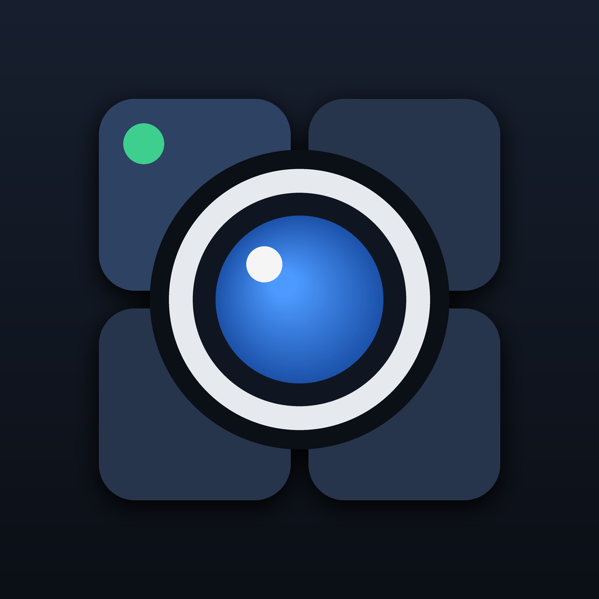

<p align="center">
  
</p>

# camwall

Mural de câmeras IP para deixar aberto o tempo todo, direto no celular ou no tablet. O app
encontra as câmeras na rede Wi-Fi, mostra o vídeo ao vivo e continua conectado pelo tempo que
você quiser. Não usa nuvem, conta nem servidor.

> **English summary.** A Flutter app for Android and iOS that finds Xiongmai-based IP cameras
> (the ones used with iCSee and XMEye) on the local Wi-Fi network and shows their live video
> continuously. It talks to the cameras directly over RTSP and ONVIF, with no cloud and no
> server. It is a companion to the vendor app, not a replacement: it does not install or
> configure cameras.

## O que este app é, e o que não é

O camwall é um **complemento** aos apps do fabricante, como o iCSee e o XMEye. Ele **não os
substitui**.

| | camwall | App do fabricante |
|---|---|---|
| Instalar a câmera e colocá-la no Wi-Fi | não | sim |
| Configurar imagem, gravação, alertas e senha | não | sim |
| Ver gravações do cartão e acessar de fora de casa | não | sim |
| Encontrar as câmeras na rede local | sim | sim |
| Ficar com o vídeo aberto por horas, sem desconectar | sim | costuma desconectar |
| Funcionar sem internet e sem conta | sim | não |

A motivação foi simples: os apps de fabricante encerram a transmissão depois de um tempo, o
que atrapalha quem quer um tablet fixo na parede mostrando as câmeras. O camwall faz só isso,
e tenta fazer bem. Você continua precisando do app do fabricante para instalar a câmera,
definir a senha e mexer nas configurações.

## Recursos

- **Busca na rede.** Toque em adicionar e o app lista as câmeras que responderam no Wi-Fi.
  Ninguém precisa saber IP nem MAC.
- **Acompanha a câmera quando o IP muda.** O app guarda o MAC e o número de série, não o IP.
  A cada 30 segundos ele confere onde cada câmera está.
- **Reconexão rápida e discreta.** Se o vídeo congelar por 6 segundos, ou a conexão cair, o
  app reabre em meio segundo, com espera crescente só se voltar a falhar. Enquanto isso a
  última imagem fica na tela, com um indicador pequeno ao lado do nome, que só aparece depois
  de 4 segundos sem imagem nova, e sai quando o vídeo
  novo aparece. Numa queda medida no iPhone 11, a imagem ao vivo voltou em cerca de 2 segundos.
  Se a câmera não voltar em 30 segundos, a imagem antiga dá lugar ao aviso, para não passar uma
  cena antiga por atual.
- **Tempo real.** O player não guarda reserva de vídeo e mostra cada quadro assim que ele chega.
  Medido no Moto G60, comparando o relógio que a câmera desenha na imagem: cerca de 1 segundo de
  atraso, estável depois de 7 minutos de exibição.
- **Mural em tela cheia.** Todas as câmeras dividem a tela, sem rolagem, e a tela não apaga.
- **Câmeras de duas lentes.** Em tela cheia, com o aparelho deitado, as duas imagens ficam
  lado a lado. Tocar numa delas abre só aquela lente, com zoom por pinça.
- **Movimento da câmera.** Um direcional na tela cheia move câmeras motorizadas: segurar move,
  soltar para. O sentido das setas é configurável por câmera.
- **Som da câmera.** Um botão na tela cheia liga o áudio ao vivo. Vem sempre desligado, e o
  mural nunca toca som, para várias câmeras não tocarem ao mesmo tempo.
- **Foto na galeria.** Outro botão salva o quadro atual, na resolução em que o vídeo está
  tocando. A imagem sai do próprio vídeo, sem abrir conexão extra com a câmera.
- **Senhas protegidas.** Ficam no Keystore do Android ou no Keychain do iOS, nunca em log.

## Compatibilidade

- **Câmeras:** as baseadas em Xiongmai, vendidas sob muitas marcas e usadas com os apps iCSee
  e XMEye. Testado com os modelos de duas lentes X6C-WEQ e X6E-WEQ.
- **Outras marcas:** dá para cadastrar informando o MAC e um modelo de URL RTSP próprio, mas a
  busca automática e o acompanhamento de IP só funcionam com Xiongmai.
- **Aparelhos:** Android 7 ou mais novo e iOS 13 ou mais novo.

## Como funciona

| Função | Protocolo |
|---|---|
| Busca e acompanhamento de IP | Descoberta Xiongmai, UDP 34569 |
| Vídeo ao vivo | RTSP por TCP, porta 554, tocado com [media_kit](https://pub.dev/packages/media_kit) |
| Movimento | ONVIF PTZ, porta 8899, com senha em digest |

Alguns detalhes que custaram para descobrir e podem poupar o tempo de alguém:

- O Android 10 em diante bloqueia a leitura da tabela ARP, e o iOS só permite broadcast UDP
  com uma autorização especial da Apple. Por isso o pedido de descoberta vai por broadcast e
  também por unicast para cada endereço da sub-rede. As câmeras respondem igual.
- As câmeras respondem sempre para a porta 34569 de quem perguntou, não para a porta de origem.
- O Dart fecha o socket UDP inteiro ao primeiro erro de envio. Quem escuta nunca envia: os
  pedidos saem de sockets descartáveis.
- Câmeras de duas lentes respondem por duas interfaces de rede, cada uma com seu MAC. O app
  junta as duas pelo número de série e não fica alternando entre elas.
- O servidor ONVIF dessas câmeras fecha a conexão se o pedido HTTP vier em modo chunked. É
  preciso informar o `Content-Length`.
- Elas anunciam o endereço do serviço de movimento com um IP de fábrica que não existe na rede.
  Só o caminho da URL é aproveitado.
- O eixo esquerda e direita do ONVIF vem invertido, então o app já inverte por padrão.
- O mural usa a imagem secundária da câmera, mais leve, e a tela cheia usa a principal.
- A lista de protocolos padrão do media_kit não inclui `rtsp`. É preciso acrescentar.
- Estas câmeras marcam o tempo errado: enviam 12,5 quadros por segundo e rotulam cada um como
  se fossem 12,0, ou seja, o relógio delas corre 4% adiantado. Um player que obedece a essas
  marcações consome 12 quadros por segundo, a câmera segura o resto, e o atraso cresce sem parar.
  Medido: 4 segundos de atraso com 1 minuto de exibição e 11 segundos com 6 minutos. Com
  `untimed` ligado, o atraso fica em torno de 1 segundo e não cresce.
- Esse atraso é invisível por dentro do app: a taxa de chegada e a de exibição são iguais e a
  fila tem meio segundo, porque o represamento acontece na câmera. Só dá para medir comparando o
  relógio desenhado na imagem com uma foto tirada da câmera no mesmo instante.
- No iPhone, o decodificador de vídeo do chip rejeita alguns quadros H.265 dessas câmeras, e a
  imagem fica cinza por instantes. No Android o chip aceita os mesmos quadros. O app decodifica
  em software no iOS: os erros de decodificação caíram de 48 para 2 a 4 em quatro minutos, e um
  iPhone 11 dá conta da imagem principal a 12 quadros por segundo, sem perda.
- Quando a conexão não abre, o media_kit não emite erro, só registra no log. E o log engana: ao
  reabrir, o cancelamento da tentativa anterior também aparece como falha de abertura. O app
  observa a propriedade `idle-active` do mpv, que só muda quando a tentativa atual termina.
- A foto em JPEG do media_kit comprime pixel a pixel em Dart e leva mais de 1 segundo na imagem
  principal. Para a imagem congelada da reconexão, o app pega a imagem crua e monta direto na
  placa de vídeo, em cerca de 0,1 segundo.

## Instalar

Ainda não há versão nas lojas. O caminho é compilar.

### Android

```bash
flutter build apk --release
```

O arquivo sai em `build/app/outputs/flutter-apk/app-release.apk`. Copie para o aparelho e
instale, ou conecte por USB com a depuração ativada e rode `flutter install`.

### iOS

Requisitos: Mac com Xcode e CocoaPods, um Apple ID e, no iOS 16 ou mais novo, o Modo de
Desenvolvedor ligado em Ajustes, Privacidade e Segurança.

1. Copie `ios/Flutter/Local.xcconfig.example` para `ios/Flutter/Local.xcconfig` e informe o
   identificador do seu time da Apple. Esse arquivo fica fora do git.
2. Se o identificador `com.welington.camwallApp` for recusado, troque por outro no Xcode.
3. Conecte o iPhone por cabo, destrave, confie no computador e rode:

   ```bash
   flutter run --release
   ```
4. Com conta gratuita, confie no seu perfil em Ajustes, Geral, VPN e Gerenciamento de
   Dispositivos.
5. Na primeira abertura, permita o acesso à rede local. Sem isso o app não encontra as câmeras.

Com Apple ID gratuito a instalação expira em 7 dias e precisa ser refeita. Com o Apple
Developer Program ela vale 1 ano.

## Segurança e privacidade

- O app só fala com as câmeras, dentro da rede local. Não tem servidor, conta, anúncios nem
  telemetria.
- O cadastro fica nas preferências do app, e as senhas no armazenamento seguro do sistema.
- A permissão de fotos serve só para gravar a imagem que você capturou. O app não lê nada da
  sua galeria.
- No ONVIF a senha segue em digest. No RTSP dessas câmeras ela vai na URL, em texto puro, como
  o próprio protocolo delas exige. Isso fica restrito à sua rede local.
- **Defina uma senha na câmera pelo app do fabricante.** Muitas saem de fábrica, ou voltam de
  um reset, com a senha em branco. Nesse estado qualquer pessoa no seu Wi-Fi vê a imagem e move
  a câmera, com este app ou com qualquer outro.

## Desenvolvimento

```bash
flutter test
dart run tool/discover.dart                 # lista as câmeras da rede, pelo computador
dart run tool/discover.dart --no-broadcast  # só unicast, como no iOS
dart run tool/onvif_check.dart 192.168.0.10 # a câmera aceita o pedido ONVIF? Sem login
python3 tool/make_icon.py && dart run flutter_launcher_icons  # regenera o ícone
```

| Arquivo | Papel |
|---|---|
| `lib/services/discovery.dart` | Descoberta por UDP, agrupamento por série e escolha de IP. Dart puro |
| `lib/services/onvif_ptz.dart` | Cliente ONVIF de movimento. Dart puro |
| `lib/services/app_controller.dart` | Cadastro, senhas e varredura periódica |
| `lib/widgets/camera_tile.dart` | Player ao vivo, recorte das lentes, congelamento e reconexão |
| `lib/widgets/ptz_pad.dart` | Direcional de movimento, com fila de comandos |
| `lib/screens/` | Mural, tela cheia, busca na rede, configurações e formulário |

No emulador Android a descoberta não funciona, porque broadcast e respostas UDP não atravessam
a rede virtual, e o vídeo não renderiza sem janela. Teste em aparelho físico. Para validar só
o player, há duas opções de desenvolvimento:

```bash
flutter run --dart-define=CAMWALL_DEBUG_URL=rtsp://10.0.2.2:8554/nome_do_stream
flutter run --dart-define=CAMWALL_DEBUG_LANDSCAPE=true
```

Para medir reconexões num aparelho, sem tocar na tela:

```bash
flutter run --profile --dart-define=CAMWALL_DIAG=true --dart-define=CAMWALL_DEBUG_OPEN=Portao --dart-define=CAMWALL_DEBUG_DROP_EVERY=25
```

`CAMWALL_DIAG` registra no log o motivo de cada reconexão, o tempo até o primeiro quadro e o
estado do player a cada 5 segundos. `CAMWALL_DEBUG_OPEN` abre a câmera com esse nome em tela
cheia ao iniciar. `CAMWALL_DEBUG_DROP_EVERY` força uma reconexão a cada tantos segundos de vídeo.
`CAMWALL_DEBUG_TIMED=true` volta a obedecer às marcações de tempo da câmera e
`CAMWALL_DEBUG_SPEED=1.04` reproduz nessa velocidade, ambos para comparar o atraso.
No iOS use `--profile`: a build de depuração às vezes não se conecta ao aparelho.

## Limitações conhecidas

- Sem gravação de vídeo, reprodução do cartão, alertas de movimento e acesso de fora de casa.
- Só dá para ouvir, não para falar. Essas câmeras não têm alto-falante.
- A busca automática só encontra câmeras Xiongmai.
- O vídeo tem de um a dois segundos de atraso, o que deixa o controle de movimento menos
  preciso que no app do fabricante.
- Sem posições memorizadas nem zoom óptico.
- Depois de reiniciar o aparelho, o app precisa ser aberto à mão.
- No iPhone a decodificação em software gasta mais bateria que a do chip, principalmente na
  tela cheia.

## Aviso

Projeto pessoal, sem vínculo com a Xiongmai nem com os apps iCSee e XMEye. Os protocolos foram
entendidos observando câmeras próprias, numa rede própria. Use apenas com câmeras suas.

## Licença

[MIT](LICENSE)
